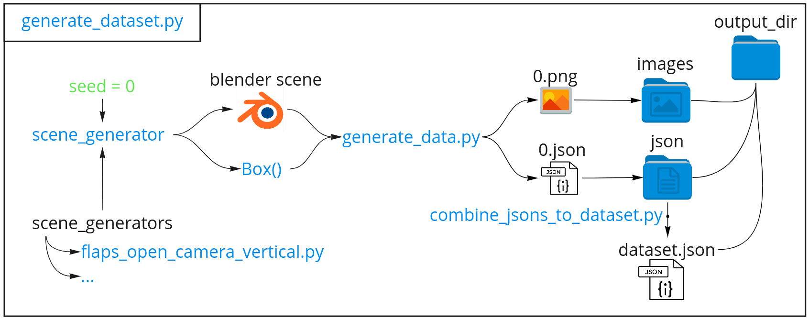

# data-generation
Generate images of boxes rendered with Blender.

## Usage
Generating a scene:
```
blender -P flaps_open_camera_vertical.py -- 42
```
Generating a data point:
```
blender -b -P generate_data.py -- flaps_open_camera_vertical 42 --resolution 128
```

Generating a dataset:
```
blender -b -P generate_dataset.py -- flaps_open_camera_vertical 1000 --resolution 128
```
By default `generate_data.py` and `generate_dataset.py` will save their results to `~/datasets`.

For an overview of the different scenes look at the `scene_generators` folder.

## Installation:
Add to `.bashrc` for convenience:
```bash
blender_path="/home/$USER/Blender/blender-3.0.0-linux-x64/"
export PATH="$PATH:$blender_path"
alias bpython="$blender_path/3.0/python/bin/python3.9"
```

Installing BlenderProc
```
cd ~
git clone https://github.com/DLR-RM/BlenderProc.git
bpython -m pip install -e BlenderProc
```

Installing the box package
```
cd data_generation
bpython -m pip install -e box
```

Install `airo-blender-toolkit`

## Downloading assets
Before running the data generation, make sure to download the necessary assets by running:
```
python3 download_assets.py
```
This will create an `assets` folder in your home folder and download HDRIs and textures.


## Overview

